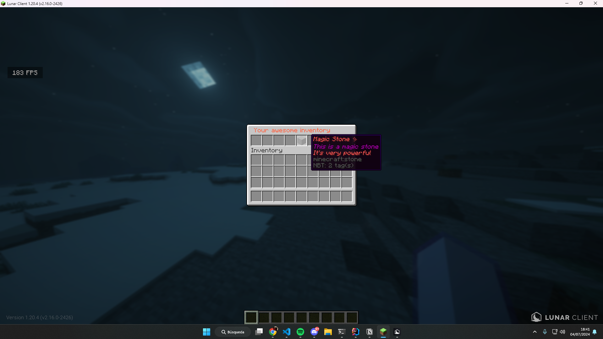

# Creating our first gui
In this section, we will go through the steps to create our first GUI using the library, we will create a simple inventory with a single item.
It will look like this:


## Initialising the library
The first step is to initialise the library, you can do this by creating a new instance with `PaperNookureInventoryEngine.Builder` and calling the `build` method.

```java
public class Main extends JavaPlugin {
  private PaperNookureInventoryEngine engine;

  @Override
  public void onEnable() {
    // Set the current class loader to the plugin class loader
    Thread.currentThread().setContextClassLoader(getClass().getClassLoader());


    // Here we are saving the default template to the plugin folder
    //           | Resource name    | Replace if exists
    saveResource("gui/our-first-gui.xml", false);

    // Create a new instance of the engine
    engine = new PaperNookureInventoryEngine.Builder()
        // Set the folder where the templates were loaded
        // in this case will be /path/to/your/server/plugins/your-plugin/gui
        .templateFolder("gui")
        // Here you pass a `JavaPlugin` instance
        .plugin(this)
        // Build the engine
        .build();
  }
}
```

## Creating the GUI
We are going to create a xml file in our resources folder, in this case, we are going to create a file called `our-first-gui.xml` at `src/main/resources/gui/our-first-gui.xml`. Please read carefully the comments in the XML file.

```xml
<!-- This is the root element of *ALL* inventories -->
<GuiLayout>
    <!-- 
      This is the head of the inventory, here you can set the title and the rows of the inventory
      Something similar to the <head> tag in HTML 🤔
    -->
    <Head>
        <!--
          Here you define the title of the inventory, the title will be parsed by the MiniMessage library
          so you can use the MiniMessage format here, but for limitations of the XML format, you need to
          use [ instead of < and ] instead of >
        -->
        <title>
            [#FF6545] Your awesome inventory
        </title>
        <!--
          Here you define the rows of the inventory, you can set the rows to 1-6
        -->
        <rows>1</rows>
    </Head>
    <!--
      This is the items element, this is the container of all items in the inventory
    -->
    <Items>
        <!--
          This is the item element, here you define the item that will be in the inventory
          We have a lot of attributes that you can use here, in this case, we are using
          the slot and material
          attributes
          slot: The slot where the item will be placed in the inventory, you can use 0-53,
                each row has 9 slots but remember that arrays start at 0, so the first slot 
                is 0
          material: The material of the item, you can use the material name or the material
                    id this should be present in the 
                    Material enum https://jd.papermc.io/paper/1.21/org/bukkit/Material.html
        -->
        <Item
                slot="4"
                material="STONE"
        >
            <!--
              This is the name of the item, here you can set the name of the item
              The name will be parsed by the MiniMessage library
              Just like the title, you need to use [ instead of < and ] instead of >
            -->
            <Name>
                [red]Magic Stone ✨[/red]
            </Name>
            <!--
              This is the lore of the item, here you can set the lore of the item
              The lore will be parsed by the MiniMessage library
              Just like the title, you need to use [ instead of < and ] instead of >
            -->
            <LiteralLore>
                This is a magic stone
                [red]It's very powerful[/red]
            </LiteralLore>
        </Item>
    </Items>
</GuiLayout>
```

## Loading the GUI with a command
Now that we have our GUI created, we need to load it, we are going to create a simple command that will open the GUI when executed.

```java
public class ExampleCommand extends Command {
  private final PaperNookureInventoryEngine engine;

  protected ExampleCommand(@NotNull PaperNookureInventoryEngine engine) {
    super("example");
    this.engine = engine;
  }

  @Override
  public boolean execute(@NotNull CommandSender sender, @NotNull String commandLabel, @NotNull String[] args) {
    if (sender instanceof Player player) {
      engine.openAsync(player, "our-first-gui.xml");
      return true;
    }

    sender.sendRichMessage("<red>You are the console!");
    return true;
  }
}
```

## Registering the command (if you don't know how to do it)
If you don't know how to register a command, you can do it like this with the `CommandMap` class.

```java
public class Main extends JavaPlugin {
  private PaperNookureInventoryEngine engine;

  @Override
  public void onEnable() {
    ...
    CommandMap commandMap = Bukkit.getServer().getCommandMap();
    commandMap.register("example", new ExampleCommand(engine));
  }

```