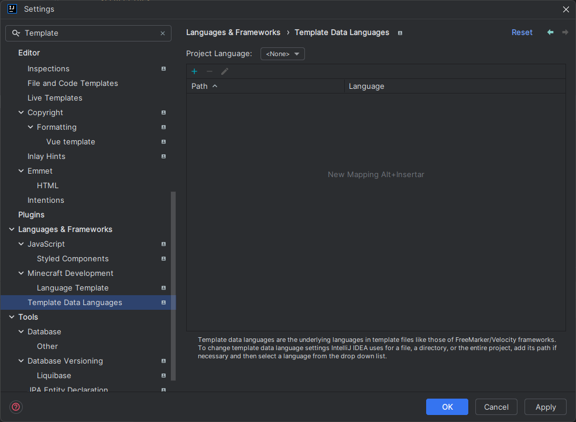
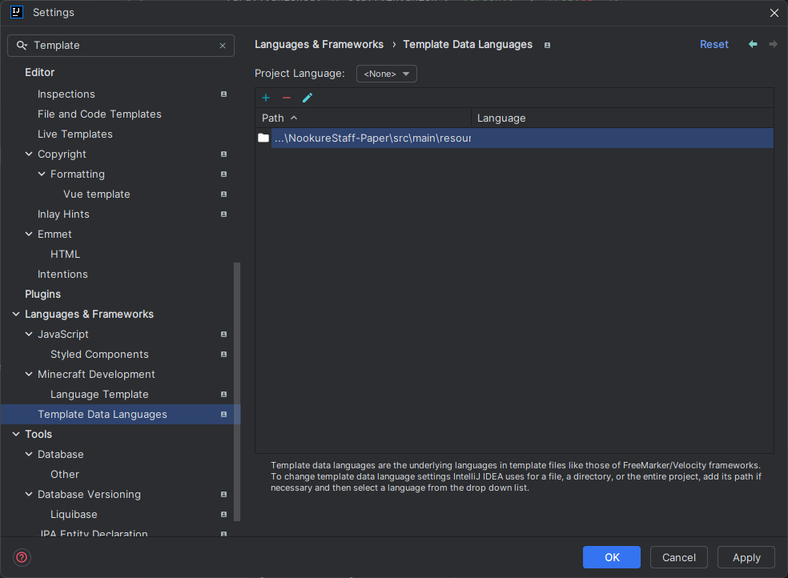
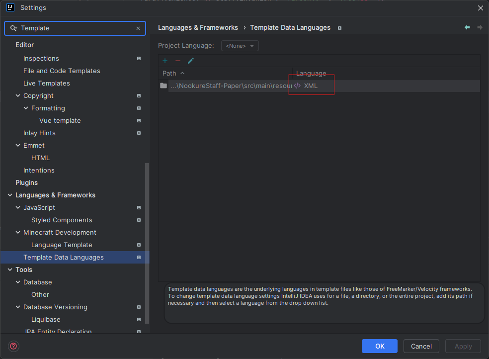
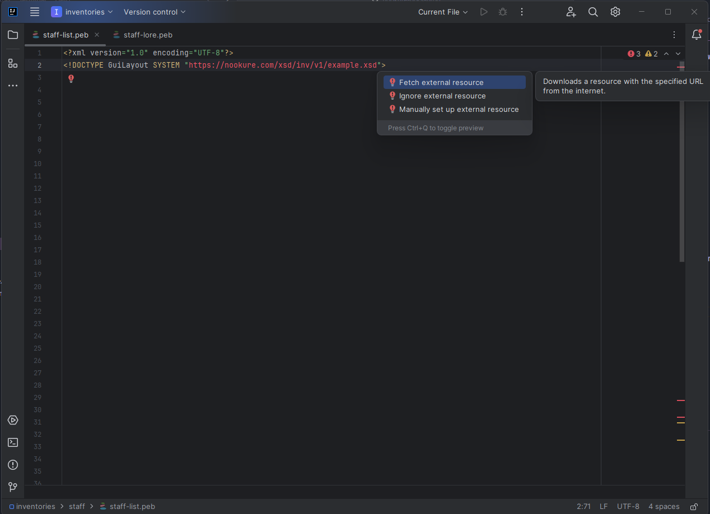

# Ide Setup
Here we are going to setup our IDE to work with the NookureInventory plugin files, we are going to use IntelliJ IDEA, it's a very powerful IDE and it's free to use.

## Requirements
- [IntelliJ IDEA](https://www.jetbrains.com/idea/download/)
- [Pebble Plugin](https://plugins.jetbrains.com/plugin/9407-pebble)

## IntelliJ IDEA Pebble Support
1. Open your project in IntelliJ IDEA
2. Install the [Pebble Plugin](https://plugins.jetbrains.com/plugin/9407-pebble)
3. Go to `File` -> `Settings` -> `Languages & Frameworks` -> `Template Data Languages`

4. Add the folder `src/main/resources/inventories` or the folder where you are going to put your templates

5. Set the language to XML

6. Click on `OK` and you are ready to go

## XML DTD Auto Completion
If you want to have auto completion for the XML DTD, you can add the DTD to the XML file, you can do this by adding the following line to the top of the XML file:
```xml
<?xml version="1.0" encoding="UTF-8"?>
<!DOCTYPE GuiLayout SYSTEM "https://nookure.com/xsd/inv/v1/GuiLayout.xsd">
```

In your IDE will appear in red, just press `Alt + Enter` and select `Fetch external resource` and you are ready to go.
