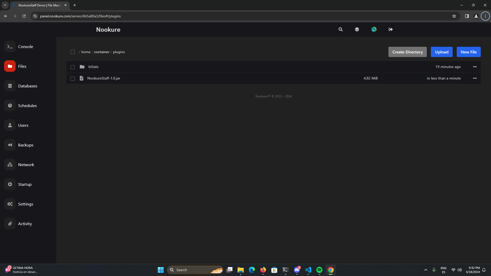

# Installation

## On a standalone server

### 1. Checking server compatibility

Before installing the plugin, you must ensure that your server is compatible with Nookure Staff. This can be done by running the command `/version`. You should check for a similar message to the following:

```
[20:13:26 INFO]: Checking version, please wait...
[20:13:26 INFO]: This server is running Paper version git-Paper-454 (MC: 1.20.4) (Implementing API version 1.20.4-R0.1-SNAPSHOT) (Git: 99a6416)
```

After finding which software version your server is running, you can check if it is compatible with your server looking at the [Support](https://nookure-docs.pages.dev/nkstaff/support.html) page.

### 2. Downloading the plugin

Now it's time to download the plugin jarfile from your preferred source, whether it's SpigotMC, BuiltByBit or Polymart. Remember that before downloading it you should log in to the website to see your license. If you haven't purchased a license yet, you can do it on any source.

After you have downloaded the plugin, you should have a file named **NookureStaff-x.x.jar**

### 3. Installing the plugin

Navigate to your server's /plugins directory and upload the jarfile you have just downloaded. Then, restart your server in order to load Nookure Staff for the first time and generate the config files.



### 4. Checking if the plugin is working

If everything is working correctly, after restarting the server Nookure Staff will start for the first time, downloading the necessary libraries from an external server (this is done to reduce the jarfile size). Then, the plugin will connect to the default SQLite server. You will see a message simmilar to this:

